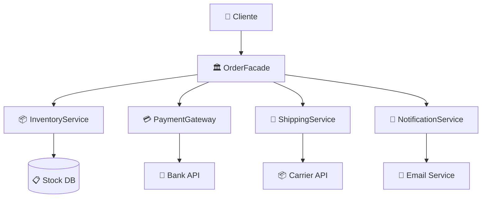

# Facade Pattern in Enterprise Applications: Simplifying Service Orchestration

*Practical implementation in Python with a real-world order management system example*


### 🔗 Useful Links
- **[Complete GitHub Repository](https://github.com/UPT-FAING-EPIS/Practice-laboratory-facade-SebastianFuentes)** - Complete source code
- **[Refactoring Guru - Facade Pattern](https://refactoring.guru/design-patterns/facade)** - Detailed theory
- **[Martin Fowler - Enterprise Patterns](https://martinfowler.com/eaaCatalog/)** - Pattern catalog

## 🎯 El Problema: Orquestación Compleja de Servicios

En el desarrollo de aplicaciones empresariales modernas, es común encontrarse con sistemas que requieren la coordinación de múltiples servicios para completar una operación de negocio. Imagina que necesitas procesar un pedido en un e-commerce:

1. **Verificar inventario** - ¿Hay stock disponible?
2. **Procesar pago** - ¿La transacción es válida?
3. **Programar envío** - ¿Cómo llegará al cliente?
4. **Notificar cliente** - ¿Cómo informamos el estado?

Sin un diseño adecuado, el código cliente se vuelve complejo y fuertemente acoplado:

```python
# ❌ Código cliente complejo sin Facade
def procesar_pedido_sin_facade(cliente, producto, cantidad, pago):
    # Cliente debe conocer TODOS los detalles internos
    inventario = InventoryService()
    gateway_pago = PaymentGateway() 
    envios = ShippingService()
    notificaciones = NotificationService()
    
    # Lógica compleja de orquestación
    if not inventario.check_stock(producto, cantidad):
        raise Exception("Stock insuficiente")
    
    if not inventario.reserve(producto, cantidad):
        raise Exception("Error reservando stock")
    
    try:
        recibo = gateway_pago.charge(pago, calcular_total(producto, cantidad))
        if not recibo.success:
            inventario.release(producto, cantidad)  # Rollback manual
            raise Exception(f"Pago fallido: {recibo.message}")
        
        envio = envios.create_shipment(cliente, [producto])
        if not envio.success:
            inventario.release(producto, cantidad)  # Más rollback manual
            # ¿Y el reembolso? ¿Más código complejo?
            raise Exception("Error en envío")
            
        # Y aún falta notificar al cliente...
        
    except Exception as e:
        # Manejo de errores complejo y propenso a bugs
        inventario.release(producto, cantidad)
        raise e
```

**Problemas evidentes:**
- 🔗 **Alto acoplamiento**: El cliente conoce detalles internos
- 🔄 **Lógica de rollback compleja**: Difícil de mantener
- 🐛 **Propenso a errores**: Muchos puntos de falla
- 📈 **Difícil de escalar**: Agregar servicios aumenta complejidad

---

## 💡 La Solución: Patrón Facade

El **patrón Facade** proporciona una interfaz unificada y simplificada para un conjunto de subsistemas, ocultando su complejidad interna y proporcionando un punto de entrada único.

### ✨ Beneficios Clave

- **🎯 Simplicidad**: Una interfaz para múltiples operaciones
- **🔓 Desacoplamiento**: El cliente no depende de implementaciones internas
- **🛡️ Abstracción**: Oculta la complejidad de subsistemas
- **🧪 Testeable**: Fácil creación de mocks y pruebas
- **🔧 Mantenible**: Cambios internos no afectan al cliente

### 🏗️ Arquitectura del Patrón



---

## 🚀 Implementación Práctica en Python

### 1. Definiendo el Facade Principal

```python
from dataclasses import dataclass
from typing import Optional
from decimal import Decimal

@dataclass
class OrderResult:
    """Resultado unificado de operación de pedido."""
    success: bool
    order_id: Optional[str] = None
    reason: Optional[str] = None
    transaction_id: Optional[str] = None
    tracking_number: Optional[str] = None
    total_amount: Optional[Decimal] = None

class OrderFacade:
    """
    Facade que simplifica la orquestación de subsistemas
    para el procesamiento de pedidos empresariales.
    """
    
    def __init__(self, inventory=None, payments=None, 
                 shipping=None, notifications=None):
        # Inyección de dependencias para flexibilidad
        self.inventory = inventory or InventoryService()
        self.payments = payments or PaymentGateway()
        self.shipping = shipping or ShippingService()
        self.notifications = notifications or NotificationService()
    
    def place_order(self, customer_id: str, sku: str, qty: int,
                   payment_info: dict, unit_price: float) -> OrderResult:
        """
        ✨ UNA SOLA MÉTODO para procesar un pedido completo.
        El Facade orquesta todos los subsistemas internamente.
        """
        order_id = str(uuid.uuid4())
        
        try:
            # 🔍 Paso 1: Verificar y reservar inventario
            if not self._reserve_inventory(sku, qty):
                return OrderResult(False, order_id, "Stock insuficiente")
            
            # 💳 Paso 2: Procesar pago
            total_amount = Decimal(str(qty * unit_price))
            payment_result = self._process_payment(payment_info, total_amount)
            if not payment_result.success:
                self._rollback_inventory(sku, qty)
                return OrderResult(False, order_id, f"Pago fallido: {payment_result.message}")
            
            # 🚚 Paso 3: Programar envío
            shipping_result = self._create_shipment(customer_id, sku, qty)
            if not shipping_result.success:
                self._rollback_inventory(sku, qty)
                return OrderResult(False, order_id, f"Error en envío: {shipping_result.message}",
                                 transaction_id=payment_result.transaction_id)
            
            # 📧 Paso 4: Notificar cliente
            self._notify_customer(customer_id, order_id, payment_result.transaction_id, 
                                shipping_result.tracking_number)
            
            # ✅ Éxito: Retornar resultado completo
            return OrderResult(
                success=True,
                order_id=order_id,
                transaction_id=payment_result.transaction_id,
                tracking_number=shipping_result.tracking_number,
                total_amount=total_amount
            )
            
        except Exception as e:
            # 🛡️ Manejo centralizado de errores
            self._handle_unexpected_error(sku, qty, order_id, str(e))
            return OrderResult(False, order_id, f"Error interno: {str(e)}")
    
    def _reserve_inventory(self, sku: str, qty: int) -> bool:
        """Encapsula la lógica de reserva de inventario."""
        return (self.inventory.check_stock(sku, qty) and 
                self.inventory.reserve(sku, qty))
    
    def _process_payment(self, payment_info: dict, amount: Decimal):
        """Encapsula el procesamiento de pagos."""
        return self.payments.charge(payment_info, float(amount))
    
    def _create_shipment(self, customer_id: str, sku: str, qty: int):
        """Encapsula la creación de envíos."""
        return self.shipping.create_shipment(
            customer_id, 
            [{"sku": sku, "qty": qty}]
        )
    
    def _notify_customer(self, customer_id: str, order_id: str, 
                        transaction_id: str, tracking_number: str):
        """Encapsula las notificaciones al cliente."""
        self.notifications.send_order_notification(
            customer_id, 
            "order_confirmed",
            {
                "order_id": order_id,
                "transaction_id": transaction_id,
                "tracking_number": tracking_number
            }
        )
    
    def _rollback_inventory(self, sku: str, qty: int):
        """Manejo centralizado de rollback de inventario."""
        self.inventory.release(sku, qty)
    
    def _handle_unexpected_error(self, sku: str, qty: int, order_id: str, error: str):
        """Manejo centralizado de errores inesperados."""
        try:
            self._rollback_inventory(sku, qty)
        except:
            pass  # Log error but don't fail twice
        
        # Log error for monitoring
        print(f"CRITICAL ERROR - Order {order_id}: {error}")
```

### 2. Subsistemas Orquestados

#### 📦 Servicio de Inventario

```python
class InventoryService:
    """Gestiona stock y reservas de productos."""
    
    def __init__(self):
        self._stock = {"LAPTOP-15": 5, "MONITOR-27": 10, "TABLET-10": 3}
    
    def check_stock(self, sku: str, qty: int) -> bool:
        """Verifica disponibilidad de stock."""
        return self._stock.get(sku, 0) >= qty
    
    def reserve(self, sku: str, qty: int) -> bool:
        """Reserva productos del inventario."""
        if self.check_stock(sku, qty):
            self._stock[sku] -= qty
            return True
        return False
    
    def release(self, sku: str, qty: int) -> None:
        """Libera reservas en caso de rollback."""
        self._stock[sku] = self._stock.get(sku, 0) + qty
```

#### 💳 Gateway de Pagos

```python
import uuid
from dataclasses import dataclass

@dataclass
class PaymentReceipt:
    success: bool
    transaction_id: str = ""
    message: str = ""

class PaymentGateway:
    """Procesa transacciones financieras."""
    
    def charge(self, payment_info: dict, amount: float) -> PaymentReceipt:
        """Procesa un cargo a la tarjeta."""
        card_number = payment_info.get("card_number", "")
        
        # Validaciones básicas
        if not card_number or len(card_number) < 15:
            return PaymentReceipt(False, "", "Tarjeta inválida")
        
        if amount <= 0:
            return PaymentReceipt(False, "", "Monto inválido")
        
        # Simulación de procesamiento por tipo de tarjeta
        if card_number.startswith("4"):  # Visa
            return PaymentReceipt(
                True, 
                str(uuid.uuid4()), 
                "Pago procesado exitosamente"
            )
        elif card_number.startswith("5"):  # MasterCard
            return PaymentReceipt(
                True, 
                str(uuid.uuid4()), 
                "Pago procesado con MasterCard"
            )
        else:
            return PaymentReceipt(False, "", "Tarjeta no soportada")
```

#### 🚚 Servicio de Envíos

```python
@dataclass
class ShipmentInfo:
    success: bool
    shipment_id: str = ""
    tracking_number: str = ""
    eta_days: int = 0
    message: str = ""

class ShippingService:
    """Gestiona logística y seguimiento de envíos."""
    
    def create_shipment(self, customer_id: str, items: list) -> ShipmentInfo:
        """Crea un nuevo envío."""
        if not items:
            return ShipmentInfo(False, message="No hay productos para enviar")
        
        shipment_id = str(uuid.uuid4())
        tracking_number = f"TRK{shipment_id[:8].upper()}"
        
        return ShipmentInfo(
            success=True,
            shipment_id=shipment_id,
            tracking_number=tracking_number,
            eta_days=3,
            message="Envío programado exitosamente"
        )
```

### 3. Uso Simplificado del Facade

```python
# ✅ Código cliente SIMPLE con Facade
def procesar_pedido_con_facade():
    facade = OrderFacade()
    
    # UNA sola llamada para toda la operación
    result = facade.place_order(
        customer_id="cliente_123",
        sku="LAPTOP-15",
        qty=1, 
        payment_info={"card_number": "4111111111111111", "cvv": "123"},
        unit_price=899.99
    )
    
    # Manejo simple de resultados
    if result.success:
        print(f"✅ ¡Pedido exitoso!")
        print(f"📦 ID: {result.order_id}")
        print(f"💳 Transacción: {result.transaction_id}")
        print(f"🚚 Seguimiento: {result.tracking_number}")
        print(f"💰 Total: ${result.total_amount}")
    else:
        print(f"❌ Error: {result.reason}")
        # El rollback ya fue manejado internamente por el Facade

# Comparación de líneas de código:
# Sin Facade: ~50 líneas complejas con manejo de errores
# Con Facade: ~15 líneas simples y claras
```

---

## 🧪 Testing del Patrón Facade

Una de las grandes ventajas del patrón Facade es que facilita enormemente el testing mediante la inyección de mocks:

```python
import pytest
from unittest.mock import Mock

class TestOrderFacade:
    def test_pedido_exitoso(self):
        """Test del flujo completo de pedido exitoso."""
        # Arrange: Crear mocks de subsistemas
        mock_inventory = Mock()
        mock_inventory.check_stock.return_value = True
        mock_inventory.reserve.return_value = True
        
        mock_payments = Mock()
        mock_payments.charge.return_value = PaymentReceipt(
            success=True, 
            transaction_id="tx-123"
        )
        
        mock_shipping = Mock()
        mock_shipping.create_shipment.return_value = ShipmentInfo(
            success=True, 
            tracking_number="TRK123"
        )
        
        mock_notifications = Mock()
        
        # Inyectar mocks en el Facade
        facade = OrderFacade(
            inventory=mock_inventory,
            payments=mock_payments, 
            shipping=mock_shipping,
            notifications=mock_notifications
        )
        
        # Act: Ejecutar operación
        result = facade.place_order(
            "customer_1", "LAPTOP-15", 1, 
            {"card_number": "4111111111111111"}, 899.99
        )
        
        # Assert: Verificar resultado y interacciones
        assert result.success is True
        assert result.transaction_id == "tx-123"
        assert result.tracking_number == "TRK123"
        
        # Verificar que todos los subsistemas fueron llamados
        mock_inventory.check_stock.assert_called_once()
        mock_payments.charge.assert_called_once()
        mock_shipping.create_shipment.assert_called_once()
        mock_notifications.send_order_notification.assert_called_once()
    
    def test_manejo_error_pago(self):
        """Test del rollback cuando falla el pago."""
        # Simular falla en el pago
        mock_inventory = Mock()
        mock_inventory.check_stock.return_value = True
        mock_inventory.reserve.return_value = True
        
        mock_payments = Mock()
        mock_payments.charge.return_value = PaymentReceipt(
            success=False, 
            message="Tarjeta rechazada"
        )
        
        facade = OrderFacade(inventory=mock_inventory, payments=mock_payments)
        
        result = facade.place_order(
            "customer_1", "LAPTOP-15", 1,
            {"card_number": "1234567890123456"}, 899.99
        )
        
        # Verificar que falló correctamente
        assert result.success is False
        assert "Pago fallido" in result.reason
        
        # Verificar que se hizo rollback del inventario
        mock_inventory.release.assert_called_once_with("LAPTOP-15", 1)
```

---

## 📊 Demo en Acción

He creado una demo ejecutable que muestra el patrón funcionando:

```bash
# Ejecutar demostración completa
python -m src.order_facade.demo

# Resultados esperados:
```

```
============================================================
  DEMO 1: PEDIDOS EXITOSOS
============================================================

🛒 Realizando pedido estándar...

=== Procesando Pedido abc12345... ===
Cliente: customer_001
Producto: MONITOR-27 x 1
Precio unitario: $299.99

[Paso 1] Verificando inventario...
[Inventory] Reservados 1 unidades de MONITOR-27. Stock restante: 9

[Paso 2] Procesando pago...
Total: $309.99 (incluye envío)
[Payment] Cargo exitoso: $309.99 en tarjeta Visa ****1111

[Paso 3] Programando envío...
[Shipping] Envío creado: TRK12345678 via Correos Nacionales
[Shipping] Entrega estimada: 2025-11-10

[Paso 4] Enviando notificaciones...
[Email] Pedido confirmado - ID: abc12345...
[SMS] Número de seguimiento: TRK12345678

✅ Pedido abc12345... procesado exitosamente!

🎯 Escenario: Pedido Estándar - Monitor 27"
✅ Estado: EXITOSO
📦 ID del Pedido: abc12345...
💳 ID Transacción: tx-67890...
🚚 Número de Seguimiento: TRK12345678
💰 Total Pagado: $309.99
📅 Entrega Estimada: 2025-11-10
```

---

## 🏗️ Cuándo Usar el Patrón Facade

### ✅ Casos Ideales

- **Sistemas con múltiples subsistemas** que necesitan orquestación
- **APIs complejas** que quieres simplificar para clientes
- **Procesos de negocio** que involucran múltiples servicios
- **Migración gradual** de sistemas legacy
- **Testing** de sistemas con muchas dependencias

### ❌ Cuándo NO Usarlo

- **Operaciones simples** que no requieren orquestación
- **Cuando necesitas acceso directo** a funcionalidades específicas
- **Sistemas pequeños** sin complejidad de subsistemas
- **Performance crítico** donde cada llamada cuenta

### 🎯 Ejemplos del Mundo Real

- **E-commerce**: Procesamiento de pedidos (como nuestro ejemplo)
- **Banking**: Transferencias que involucran múltiples validaciones
- **Healthcare**: Sistemas de citas que coordinan doctores, salas, equipos
- **Logistics**: Seguimiento de paquetes a través de múltiples carriers
- **Enterprise Software**: Workflows que integran CRM, ERP, y sistemas de facturación

---

## 🚀 Beneficios Demostrados

### Para el Negocio
- ⚡ **Desarrollo más rápido**: Menos código repetitivo
- 🐛 **Menos bugs**: Lógica centralizada y probada
- 🔧 **Mantenimiento fácil**: Cambios internos sin impacto al cliente
- 📈 **Escalabilidad**: Fácil agregar nuevos subsistemas

### Para el Desarrollador
- 🧪 **Testing simplificado**: Mocks fáciles de crear
- 📖 **Código más legible**: Interfaz clara y bien documentada
- 🔄 **Reutilización**: Facade usado en múltiples contextos
- 🛡️ **Manejo de errores**: Centralizado y consistente

### Para el Cliente/Usuario
- 🎯 **API simple**: Una llamada para operaciones complejas
- 🔒 **Consistencia**: Comportamiento predecible
- ⚡ **Performance**: Optimizaciones internas transparentes
- 📊 **Observabilidad**: Logging y métricas integradas

---

## 🎯 Conclusiones y Mejores Prácticas

### ✅ Principios Clave Aplicados

1. **Single Responsibility**: El Facade orquesta, no implementa lógica de negocio
2. **Open/Closed**: Fácil extender con nuevos subsistemas
3. **Dependency Inversion**: Depende de interfaces, no implementaciones concretas
4. **Interface Segregation**: Interfaz específica para cada responsabilidad

### 🛡️ Mejores Prácticas

```python
# ✅ DO: Inyección de dependencias para flexibilidad
class OrderFacade:
    def __init__(self, inventory=None, payments=None):
        self.inventory = inventory or DefaultInventoryService()
        self.payments = payments or DefaultPaymentGateway()

# ✅ DO: Retornar resultados estructurados
@dataclass 
class OrderResult:
    success: bool
    reason: Optional[str] = None
    # Más campos según necesidad

# ✅ DO: Manejo centralizado de errores
def place_order(self, ...):
    try:
        # Lógica principal
        pass
    except Exception as e:
        return self._handle_error(e, context)

# ❌ DON'T: Convertir el Facade en un God Object
# No implementes TODA la lógica en el Facade, delega a subsistemas

# ❌ DON'T: Ocultar TODA la funcionalidad de subsistemas
# Permite acceso directo cuando sea necesario
```

### 🔮 Evolución y Extensibilidad

```python
# Fácil agregar nuevos subsistemas
class OrderFacade:
    def __init__(self, inventory=None, payments=None, 
                 fraud_detection=None, analytics=None):  # ← Nuevos servicios
        # ...
    
    def place_order(self, ...):
        # Paso 1: Verificar inventario
        # Paso 2: Detectar fraude ← Nuevo paso
        # Paso 3: Procesar pago  
        # Paso 4: Enviar
        # Paso 5: Analytics ← Nuevo paso
        # Paso 6: Notificar
```

---

## 📚 Recursos Adicionales

### 🛠️ Tecnologías Utilizadas
- **Python 3.8+** - Lenguaje principal
- **Pytest** - Framework de testing
- **Dataclasses** - Estructuras de datos
- **Type Hints** - Documentación de tipos
- **UUID** - Generación de IDs únicos

### 📖 Para Seguir Aprendiendo
1. **Experimenta** con el código: clona el repo y modifica los subsistemas
2. **Extiende** la funcionalidad: agrega nuevos tipos de productos o métodos de pago
3. **Practica testing**: crea nuevos casos de prueba y mocks
4. **Aplica** en proyectos reales: identifica oportunidades en tu código actual

---

*¿Te gustó este artículo? Dale ❤️ y compártelo con otros desarrolladores. ¿Tienes preguntas o sugerencias? ¡Déjalas en los comentarios!*