### 🔗 Useful Links
- **[Complete GitHub Repository](https://github.com/UPT-FAING-EPIS/Practice-laboratory-facade-SebastianFuentes)** - Complete source code
- **[Refactoring Guru - Facade Pattern](https://refactoring.guru/design-patterns/facade)** - Detailed theory
- **[Martin Fowler - Enterprise Patterns](https://martinfowler.com/eaaCatalog/)** - Pattern catalog

*Practical implementation in Python with a real-world order management system example*


## 🎯 The Problem: Complex Service Orchestration

In modern enterprise application development, it's common to encounter systems that require coordination of multiple services to complete a business operation. Imagine you need to process an order in an e-commerce system:

1. **Check inventory** - Is stock available?
2. **Process payment** - Is the transaction valid?
3. **Schedule shipping** - How will it reach the customer?
4. **Notify customer** - How do we inform about the status?

Without proper design, the client code becomes complex and tightly coupled:

```python
# ❌ Complex client code without Facade
def process_order_without_facade(customer, product, quantity, payment):
    # Client must know ALL internal details
    inventory = InventoryService()
    payment_gateway = PaymentGateway() 
    shipping = ShippingService()
    notifications = NotificationService()
    
    # Complex orchestration logic
    if not inventory.check_stock(product, quantity):
        raise Exception("Insufficient stock")
    
    if not inventory.reserve(product, quantity):
        raise Exception("Error reserving stock")
    
    try:
        receipt = payment_gateway.charge(payment, calculate_total(product, quantity))
        if not receipt.success:
            inventory.release(product, quantity)  # Manual rollback
            raise Exception(f"Payment failed: {receipt.message}")
        
        shipment = shipping.create_shipment(customer, [product])
        if not shipment.success:
            inventory.release(product, quantity)  # More manual rollback
            # What about refunds? More complex code?
            raise Exception("Shipping error")
            
        # Still need to notify the customer...
        
    except Exception as e:
        # Complex error handling prone to bugs
        inventory.release(product, quantity)
        raise e
```

**Evident problems:**
- 🔗 **High coupling**: Client knows internal details
- 🔄 **Complex rollback logic**: Difficult to maintain
- 🐛 **Error-prone**: Many failure points
- 📈 **Hard to scale**: Adding services increases complexity

---

## 💡 The Solution: Facade Pattern

The **Facade pattern** provides a unified and simplified interface for a set of subsystems, hiding their internal complexity and providing a single entry point.

### ✨ Key Benefits

- **🎯 Simplicity**: One interface for multiple operations
- **🔓 Decoupling**: Client doesn't depend on internal implementations
- **🛡️ Abstraction**: Hides subsystem complexity
- **🧪 Testable**: Easy creation of mocks and tests
- **🔧 Maintainable**: Internal changes don't affect client

### 🏗️ Pattern Architecture

```mermaid
graph TB
    Client[👤 Client] --> Facade[🏛️ OrderFacade]
    
    Facade --> Inventory[📦 InventoryService]
    Facade --> Payment[💳 PaymentGateway] 
    Facade --> Shipping[🚚 ShippingService]
    Facade --> Notification[📧 NotificationService]
    
    Inventory --> DB1[(📋 Stock DB)]
    Payment --> Bank[🏦 Bank API]
    Shipping --> Carrier[📦 Carrier API]
    Notification --> Email[📧 Email Service]
```



---

## 🚀 Practical Implementation in Python

### 1. Defining the Main Facade

```python
from dataclasses import dataclass
from typing import Optional
from decimal import Decimal

@dataclass
class OrderResult:
    """Unified result of order operation."""
    success: bool
    order_id: Optional[str] = None
    reason: Optional[str] = None
    transaction_id: Optional[str] = None
    tracking_number: Optional[str] = None
    total_amount: Optional[Decimal] = None

class OrderFacade:
    """
    Facade that simplifies subsystem orchestration
    for enterprise order processing.
    """
    
    def __init__(self, inventory=None, payments=None, 
                 shipping=None, notifications=None):
        # Dependency injection for flexibility
        self.inventory = inventory or InventoryService()
        self.payments = payments or PaymentGateway()
        self.shipping = shipping or ShippingService()
        self.notifications = notifications or NotificationService()
    
    def place_order(self, customer_id: str, sku: str, qty: int,
                   payment_info: dict, unit_price: float) -> OrderResult:
        """
        ✨ ONE SINGLE METHOD to process a complete order.
        The Facade orchestrates all subsystems internally.
        """
        order_id = str(uuid.uuid4())
        
        try:
            # 🔍 Step 1: Verify and reserve inventory
            if not self._reserve_inventory(sku, qty):
                return OrderResult(False, order_id, "Insufficient stock")
            
            # 💳 Step 2: Process payment
            total_amount = Decimal(str(qty * unit_price))
            payment_result = self._process_payment(payment_info, total_amount)
            if not payment_result.success:
                self._rollback_inventory(sku, qty)
                return OrderResult(False, order_id, f"Payment failed: {payment_result.message}")
            
            # 🚚 Step 3: Schedule shipping
            shipping_result = self._create_shipment(customer_id, sku, qty)
            if not shipping_result.success:
                self._rollback_inventory(sku, qty)
                return OrderResult(False, order_id, f"Shipping error: {shipping_result.message}",
                                 transaction_id=payment_result.transaction_id)
            
            # 📧 Step 4: Notify customer
            self._notify_customer(customer_id, order_id, payment_result.transaction_id, 
                                shipping_result.tracking_number)
            
            # ✅ Success: Return complete result
            return OrderResult(
                success=True,
                order_id=order_id,
                transaction_id=payment_result.transaction_id,
                tracking_number=shipping_result.tracking_number,
                total_amount=total_amount
            )
            
        except Exception as e:
            # 🛡️ Centralized error handling
            self._handle_unexpected_error(sku, qty, order_id, str(e))
            return OrderResult(False, order_id, f"Internal error: {str(e)}")
    
    def _reserve_inventory(self, sku: str, qty: int) -> bool:
        """Encapsulates inventory reservation logic."""
        return (self.inventory.check_stock(sku, qty) and 
                self.inventory.reserve(sku, qty))
    
    def _process_payment(self, payment_info: dict, amount: Decimal):
        """Encapsulates payment processing."""
        return self.payments.charge(payment_info, float(amount))
    
    def _create_shipment(self, customer_id: str, sku: str, qty: int):
        """Encapsulates shipment creation."""
        return self.shipping.create_shipment(
            customer_id, 
            [{"sku": sku, "qty": qty}]
        )
    
    def _notify_customer(self, customer_id: str, order_id: str, 
                        transaction_id: str, tracking_number: str):
        """Encapsulates customer notifications."""
        self.notifications.send_order_notification(
            customer_id, 
            "order_confirmed",
            {
                "order_id": order_id,
                "transaction_id": transaction_id,
                "tracking_number": tracking_number
            }
        )
    
    def _rollback_inventory(self, sku: str, qty: int):
        """Centralized inventory rollback handling."""
        self.inventory.release(sku, qty)
    
    def _handle_unexpected_error(self, sku: str, qty: int, order_id: str, error: str):
        """Centralized unexpected error handling."""
        try:
            self._rollback_inventory(sku, qty)
        except:
            pass  # Log error but don't fail twice
        
        # Log error for monitoring
        print(f"CRITICAL ERROR - Order {order_id}: {error}")
```

### 2. Orchestrated Subsystems

#### 📦 Inventory Service

```python
class InventoryService:
    """Manages product stock and reservations."""
    
    def __init__(self):
        self._stock = {"LAPTOP-15": 5, "MONITOR-27": 10, "TABLET-10": 3}
    
    def check_stock(self, sku: str, qty: int) -> bool:
        """Verifies stock availability."""
        return self._stock.get(sku, 0) >= qty
    
    def reserve(self, sku: str, qty: int) -> bool:
        """Reserves products from inventory."""
        if self.check_stock(sku, qty):
            self._stock[sku] -= qty
            return True
        return False
    
    def release(self, sku: str, qty: int) -> None:
        """Releases reservations in case of rollback."""
        self._stock[sku] = self._stock.get(sku, 0) + qty
```

#### 💳 Payment Gateway

```python
import uuid
from dataclasses import dataclass

@dataclass
class PaymentReceipt:
    success: bool
    transaction_id: str = ""
    message: str = ""

class PaymentGateway:
    """Processes financial transactions."""
    
    def charge(self, payment_info: dict, amount: float) -> PaymentReceipt:
        """Processes a card charge."""
        card_number = payment_info.get("card_number", "")
        
        # Basic validations
        if not card_number or len(card_number) < 15:
            return PaymentReceipt(False, "", "Invalid card")
        
        if amount <= 0:
            return PaymentReceipt(False, "", "Invalid amount")
        
        # Processing simulation by card type
        if card_number.startswith("4"):  # Visa
            return PaymentReceipt(
                True, 
                str(uuid.uuid4()), 
                "Payment processed successfully"
            )
        elif card_number.startswith("5"):  # MasterCard
            return PaymentReceipt(
                True, 
                str(uuid.uuid4()), 
                "Payment processed with MasterCard"
            )
        else:
            return PaymentReceipt(False, "", "Unsupported card")
```

#### 🚚 Shipping Service

```python
@dataclass
class ShipmentInfo:
    success: bool
    shipment_id: str = ""
    tracking_number: str = ""
    eta_days: int = 0
    message: str = ""

class ShippingService:
    """Manages logistics and shipment tracking."""
    
    def create_shipment(self, customer_id: str, items: list) -> ShipmentInfo:
        """Creates a new shipment."""
        if not items:
            return ShipmentInfo(False, message="No items to ship")
        
        shipment_id = str(uuid.uuid4())
        tracking_number = f"TRK{shipment_id[:8].upper()}"
        
        return ShipmentInfo(
            success=True,
            shipment_id=shipment_id,
            tracking_number=tracking_number,
            eta_days=3,
            message="Shipment scheduled successfully"
        )
```

### 3. Simplified Facade Usage

```python
# ✅ SIMPLE client code with Facade
def process_order_with_facade():
    facade = OrderFacade()
    
    # ONE single call for the entire operation
    result = facade.place_order(
        customer_id="customer_123",
        sku="LAPTOP-15",
        qty=1, 
        payment_info={"card_number": "4111111111111111", "cvv": "123"},
        unit_price=899.99
    )
    
    # Simple result handling
    if result.success:
        print(f"✅ Order successful!")
        print(f"📦 ID: {result.order_id}")
        print(f"💳 Transaction: {result.transaction_id}")
        print(f"🚚 Tracking: {result.tracking_number}")
        print(f"💰 Total: ${result.total_amount}")
    else:
        print(f"❌ Error: {result.reason}")
        # Rollback already handled internally by the Facade

# Lines of code comparison:
# Without Facade: ~50 complex lines with error handling
# With Facade: ~15 simple and clear lines
```

---

## 🧪 Testing the Facade Pattern

One of the great advantages of the Facade pattern is that it greatly facilitates testing through dependency injection of mocks:

```python
import pytest
from unittest.mock import Mock

class TestOrderFacade:
    def test_successful_order(self):
        """Test complete successful order flow."""
        # Arrange: Create subsystem mocks
        mock_inventory = Mock()
        mock_inventory.check_stock.return_value = True
        mock_inventory.reserve.return_value = True
        
        mock_payments = Mock()
        mock_payments.charge.return_value = PaymentReceipt(
            success=True, 
            transaction_id="tx-123"
        )
        
        mock_shipping = Mock()
        mock_shipping.create_shipment.return_value = ShipmentInfo(
            success=True, 
            tracking_number="TRK123"
        )
        
        mock_notifications = Mock()
        
        # Inject mocks into Facade
        facade = OrderFacade(
            inventory=mock_inventory,
            payments=mock_payments, 
            shipping=mock_shipping,
            notifications=mock_notifications
        )
        
        # Act: Execute operation
        result = facade.place_order(
            "customer_1", "LAPTOP-15", 1, 
            {"card_number": "4111111111111111"}, 899.99
        )
        
        # Assert: Verify result and interactions
        assert result.success is True
        assert result.transaction_id == "tx-123"
        assert result.tracking_number == "TRK123"
        
        # Verify all subsystems were called
        mock_inventory.check_stock.assert_called_once()
        mock_payments.charge.assert_called_once()
        mock_shipping.create_shipment.assert_called_once()
        mock_notifications.send_order_notification.assert_called_once()
    
    def test_payment_error_handling(self):
        """Test rollback when payment fails."""
        # Simulate payment failure
        mock_inventory = Mock()
        mock_inventory.check_stock.return_value = True
        mock_inventory.reserve.return_value = True
        
        mock_payments = Mock()
        mock_payments.charge.return_value = PaymentReceipt(
            success=False, 
            message="Card declined"
        )
        
        facade = OrderFacade(inventory=mock_inventory, payments=mock_payments)
        
        result = facade.place_order(
            "customer_1", "LAPTOP-15", 1,
            {"card_number": "1234567890123456"}, 899.99
        )
        
        # Verify it failed correctly
        assert result.success is False
        assert "Payment failed" in result.reason
        
        # Verify inventory rollback was performed
        mock_inventory.release.assert_called_once_with("LAPTOP-15", 1)
```

---

## 📊 Demo in Action

I've created an executable demo that shows the pattern working:

```bash
# Run complete demonstration
python -m src.order_facade.demo

# Expected results:
```

```
============================================================
  DEMO 1: SUCCESSFUL ORDERS
============================================================

🛒 Processing standard order...

=== Processing Order abc12345... ===
Customer: customer_001
Product: MONITOR-27 x 1
Unit price: $299.99

[Step 1] Verifying inventory...
[Inventory] Reserved 1 units of MONITOR-27. Remaining stock: 9

[Step 2] Processing payment...
Total: $309.99 (includes shipping)
[Payment] Successful charge: $309.99 on Visa card ****1111

[Step 3] Scheduling shipping...
[Shipping] Shipment created: TRK12345678 via National Mail
[Shipping] Estimated delivery: 2025-11-10

[Step 4] Sending notifications...
[Email] Order confirmed - ID: abc12345...
[SMS] Tracking number: TRK12345678

✅ Order abc12345... processed successfully!

🎯 Scenario: Standard Order - Monitor 27"
✅ Status: SUCCESS
📦 Order ID: abc12345...
💳 Transaction ID: tx-67890...
🚚 Tracking Number: TRK12345678
💰 Total Paid: $309.99
📅 Estimated Delivery: 2025-11-10
```

---

## 🏗️ When to Use the Facade Pattern

### ✅ Ideal Cases

- **Systems with multiple subsystems** that need orchestration
- **Complex APIs** you want to simplify for clients
- **Business processes** involving multiple services
- **Gradual migration** from legacy systems
- **Testing** systems with many dependencies

### ❌ When NOT to Use It

- **Simple operations** that don't require orchestration
- **When you need direct access** to specific functionalities
- **Small systems** without subsystem complexity
- **Performance critical** scenarios where every call counts

### 🎯 Real-World Examples

- **E-commerce**: Order processing (like our example)
- **Banking**: Transfers involving multiple validations
- **Healthcare**: Appointment systems coordinating doctors, rooms, equipment
- **Logistics**: Package tracking through multiple carriers
- **Enterprise Software**: Workflows integrating CRM, ERP, and billing systems

---

## 🚀 Demonstrated Benefits

### For Business
- ⚡ **Faster development**: Less repetitive code
- 🐛 **Fewer bugs**: Centralized and tested logic
- 🔧 **Easy maintenance**: Internal changes without client impact
- 📈 **Scalability**: Easy to add new subsystems

### For Developers
- 🧪 **Simplified testing**: Easy-to-create mocks
- 📖 **More readable code**: Clear and well-documented interface
- 🔄 **Reusability**: Facade used in multiple contexts
- 🛡️ **Error handling**: Centralized and consistent

### For Client/User
- 🎯 **Simple API**: One call for complex operations
- 🔒 **Consistency**: Predictable behavior
- ⚡ **Performance**: Transparent internal optimizations
- 📊 **Observability**: Integrated logging and metrics

---

## 🎯 Conclusions and Best Practices

### ✅ Key Principles Applied

1. **Single Responsibility**: Facade orchestrates, doesn't implement business logic
2. **Open/Closed**: Easy to extend with new subsystems
3. **Dependency Inversion**: Depends on interfaces, not concrete implementations
4. **Interface Segregation**: Specific interface for each responsibility

### 🛡️ Best Practices

```python
# ✅ DO: Dependency injection for flexibility
class OrderFacade:
    def __init__(self, inventory=None, payments=None):
        self.inventory = inventory or DefaultInventoryService()
        self.payments = payments or DefaultPaymentGateway()

# ✅ DO: Return structured results
@dataclass 
class OrderResult:
    success: bool
    reason: Optional[str] = None
    # More fields as needed

# ✅ DO: Centralized error handling
def place_order(self, ...):
    try:
        # Main logic
        pass
    except Exception as e:
        return self._handle_error(e, context)

# ❌ DON'T: Turn Facade into a God Object
# Don't implement ALL logic in the Facade, delegate to subsystems

# ❌ DON'T: Hide ALL subsystem functionality
# Allow direct access when necessary
```

### 🔮 Evolution and Extensibility

```python
# Easy to add new subsystems
class OrderFacade:
    def __init__(self, inventory=None, payments=None, 
                 fraud_detection=None, analytics=None):  # ← New services
        # ...
    
    def place_order(self, ...):
        # Step 1: Check inventory
        # Step 2: Detect fraud ← New step
        # Step 3: Process payment  
        # Step 4: Ship
        # Step 5: Analytics ← New step
        # Step 6: Notify
```

---

## 📚 Additional Resources

### 🛠️ Technologies Used
- **Python 3.8+** - Main language
- **Pytest** - Testing framework
- **Dataclasses** - Data structures
- **Type Hints** - Type documentation
- **UUID** - Unique ID generation

### 📖 To Continue Learning
1. **Experiment** with the code: clone the repo and modify subsystems
2. **Extend** functionality: add new product types or payment methods
3. **Practice testing**: create new test cases and mocks
4. **Apply** in real projects: identify opportunities in your current code

---

*Did you like this article? Give it a ❤️ and share it with other developers. Have questions or suggestions? Leave them in the comments!*

## Tags
#designpatterns #python #softwarearchitecture #enterprisepatterns #facade #softwaredevelopment #programming #coding #python3